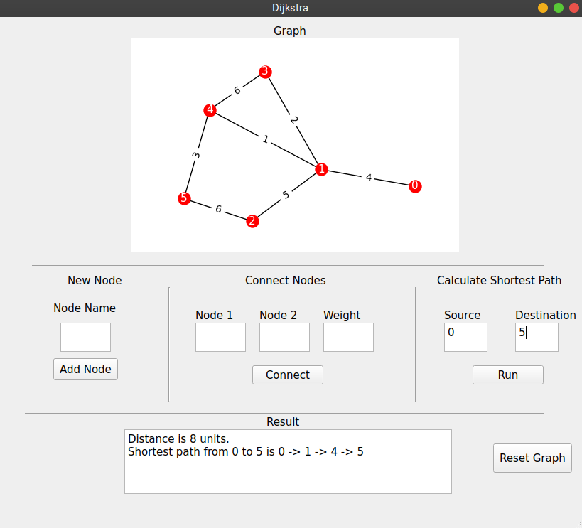

## Qt and Networkx based Dijkstra's Algorithm

### **Installing**

1) Install the virtualenv module.\
    `pip install virtualenv`

2) create a virtual environment.\
`virtualenv dijkstra_ws`

3) activate the virtual environment.\
`cd dijkstra_ws`\
`source bin/activate`

4) Clone the repo and install dependencies.\
    `git clone https://github.com/mucozcan/dijkstra-pyqt.git`\
    `pip install -r requirements.txt`

**After successfully installed, simply run:** `python main.py`

***Detailed technical documentation of classes and functions is included under `docs` directory.**

### TODO 
 - Responsive UI design.
 - Changing graph input from dict to adjacency matrix.
 - Adding revert changes functionality.\

**Any contribution is welcome.**